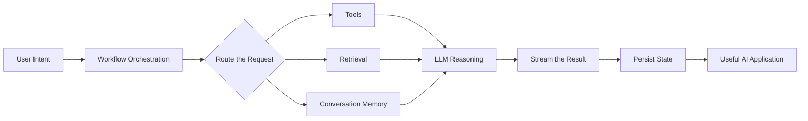

<div align="center">


<a href="https://x.com/nilaymallikX">
  
</a>
<a href="https://www.linkedin.com/in/nilaymallik/">
  
</a>
<a href="mailto:nilaymallikk@gmail.com">
  
</a>
<p>to get a fast reply dm me on X<p/>

<br/><br/>


</div>

---

> **My projects focus on more than calling an LLM API. They combine retrieval, orchestration, memory, tools, streaming and persistent state to create complete AI applications.**

## `nilay@github:~$ whoami`

```yaml
name: Nilay Mallik
education: B.Tech in Computer Science and Engineering
university: KIIT University, Bhubaneswar
graduation: 2027

direction:
  - AI Engineering
  - Agentic AI Systems
  - Retrieval-Augmented Generation
  - Multi-Agent Applications

build_philosophy: "Understand the system. Build the system. Ship the system."
```

## About Me

I enjoy working at the point where AI meets backend engineering.

-  **What I build:** agentic assistants, RAG systems, multi-agent workflows and LLM-powered applications
-  **What interests me:** tool routing, retrieval quality, reranking, long-term memory and persistent state
-  **How my projects are structured:** define the workflow, connect the required tools and data, preserve state, then expose the system through a usable interface
-  **What my projects emphasize:** clear workflow design, stronger retrieval, persistent context and complete user-facing applications
-  **What I enjoy shipping:** complete projects with an API, interface, database, streaming and deployment setup
-  **What I am developing:** stronger AI system-design and production-engineering skills
-  **Where I am heading:** becoming an AI engineer who can take an idea from architecture to deployment
-  **What I am open to:** internships, technical collaborations and conversations about agentic AI or RAG

## My AI Engineering Map



<div align="center">

**Retrieve → Route → Reason → Act → Stream → Remember → Ship**

</div>

## What I Build Around the Model

| Layer | What I Work With |
|---|---|
| **Orchestration** | LangGraph state machines, conditional routing, parallel workflows and multi-agent coordination |
| **Retrieval** | Dense vector search, BM25, hybrid retrieval, Reciprocal Rank Fusion and reranking |
| **Memory & State** | Redis conversation memory, PostgreSQL checkpointing and thread-isolated vector collections |
| **Interfaces** | FastAPI backends, Streamlit applications, browser interfaces and REST APIs |
| **Real-time UX** | Server-Sent Events and token or pipeline-stage streaming |
| **Infrastructure** | Docker, GitHub Actions, databases, vector stores and deployable project structures |

## Technical Toolbox

### Core Languages

<p>
  
</p>

### AI & Agentic Systems

<p>
  
  
  
  
  
</p>

### Backend, Data & Delivery

<p>
  
</p>

<p>
  
  
  
  
</p>

### Development Environment

```yaml
OS: Fedora Linux (primary os that i use)
Desktop: GNOME
Editor: VS Code, Cursor
Shell: Bash, Fish
Containerization: Docker
Version Control: Git & GitHub
```

## Selected Systems

### 01 [Nilora](https://github.com/nilaymallikk/Nilora)
**An agentic AI chatbot designed as a stateful system rather than a single prompt-response loop.**

```text
User request
   └── LangGraph router
         ├── Web search
         ├── Calculator
         ├── Document retrieval
         └── Long-term memory
                └── Streamed response + persistent conversation state
```

**Engineering highlights**

- Conditional tool routing through a LangGraph state machine
- Multi-format RAG for PDF, DOCX, TXT, Markdown, Python and CSV files
- Thread-isolated ChromaDB collections for private conversation retrieval
- Persistent cross-session memory
- SSE token streaming and speech-to-text input
- Dockerized application setup

**Stack:** `Python` `FastAPI` `LangChain` `LangGraph` `Gemini` `ChromaDB` `Docker`

---

### 02 [MLGPT](https://github.com/nilaymallikk/MLGPT)
**A production-style RAG chatbot focused on improving retrieval before generation.**

```text
Query
  ├── Pinecone dense retrieval
  └── BM25 lexical retrieval
          ↓
 Reciprocal Rank Fusion
          ↓
 CrossEncoder reranking
          ↓
       Generation
```

**Engineering highlights**

- Hybrid retrieval using dense vector search and BM25
- Reciprocal Rank Fusion to combine retrieval results
- CrossEncoder reranking before generation
- Redis-backed conversation memory
- FastAPI service with a Streamlit chat interface

**Stack:** `Python` `FastAPI` `Streamlit` `Pinecone` `Redis` `LangChain`

---

### 03 [KinetiBlog](https://github.com/nilaymallikk/KinetiBlog)
**A technical-writing agent that researches, plans and drafts through a coordinated workflow.**

**Engineering highlights**

- Routes topics based on whether external research is required
- Researches with the Tavily Search API
- Plans and generates article sections in parallel
- Merges sections and adds generated visuals
- Streams each pipeline stage to the browser through SSE
- Uses PostgreSQL checkpointing with an in-memory fallback

**Stack:** `Python` `FastAPI` `LangGraph` `PostgreSQL` `Tavily Search API`

---

### 04 [RoamAI](https://github.com/nilaymallikk/RoamAI)
**A multi-agent travel-planning application currently in active development.**

**Current direction**

- Python-powered application backend
- JavaScript and CSS browser interface
- Multi-agent trip-planning workflow
- Docker-based delivery setup

**Stack:** `Python` `JavaScript` `CSS` `Docker`

## The Pattern Behind My Projects

```text
Recurring engineering questions across my projects:

1. What decision does the workflow need to make?
2. What information should be retrieved?
3. Which tools or agents should handle each step?
4. What context must survive across requests?
5. How should progress be streamed to the user?
6. Where should application state be stored?
7. How can the complete system be packaged and shipped?
```

## GitHub Pulse

<div align="left">

<br/>


</div>
<br/><br/>

**Build deeply. Learn continuously. Ship what works.**


</div>
